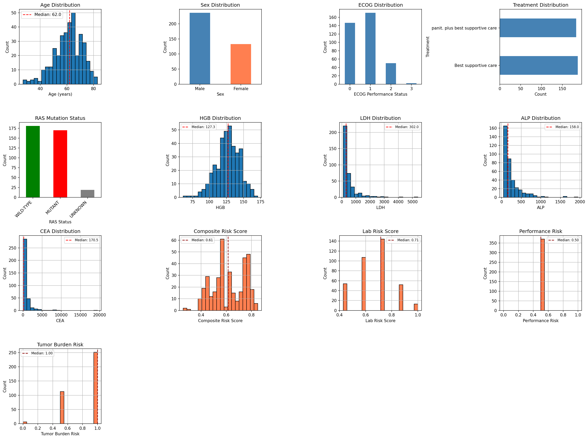
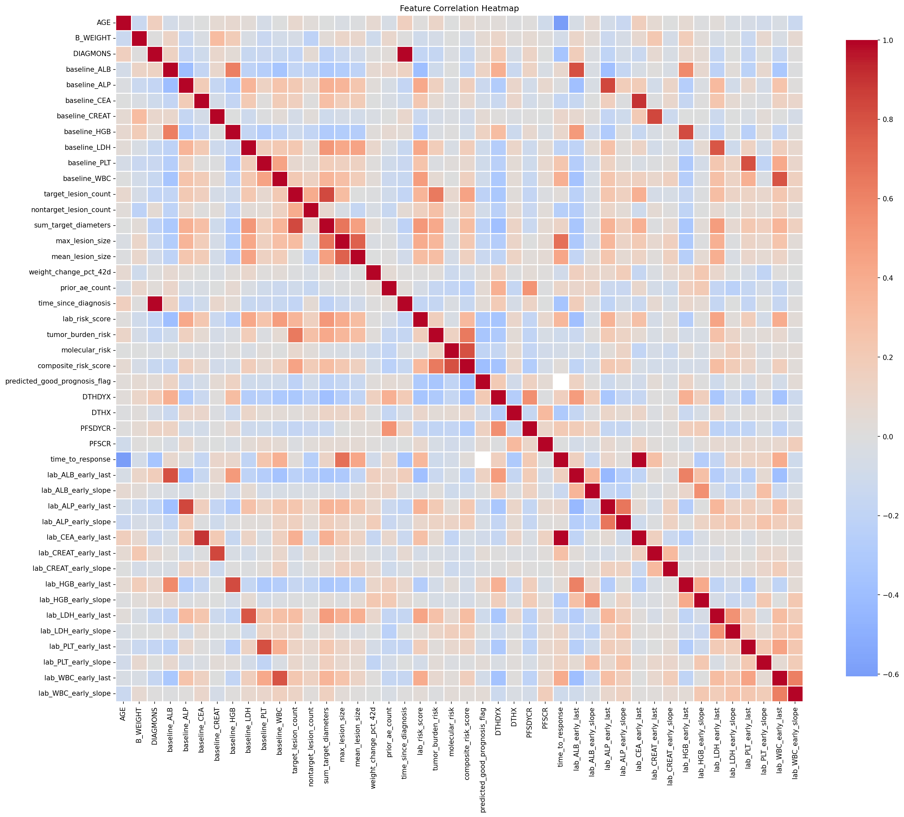
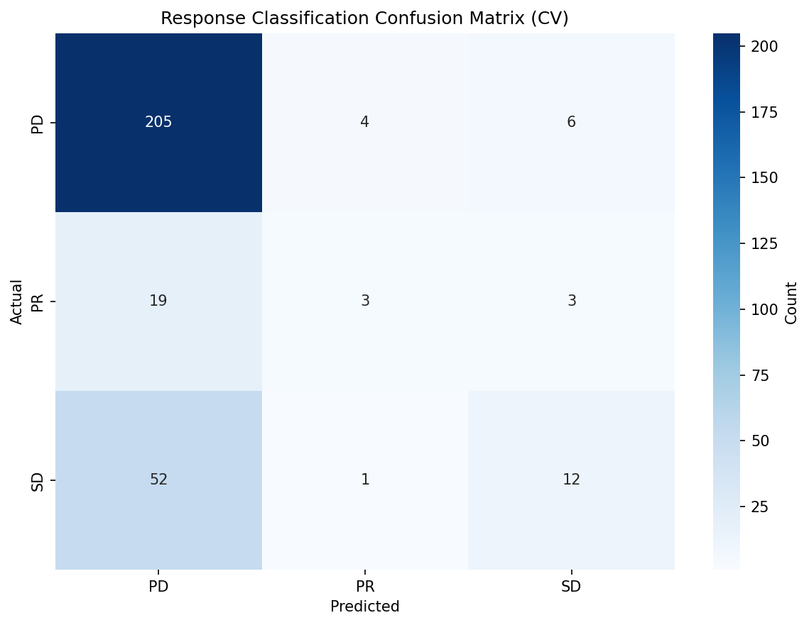
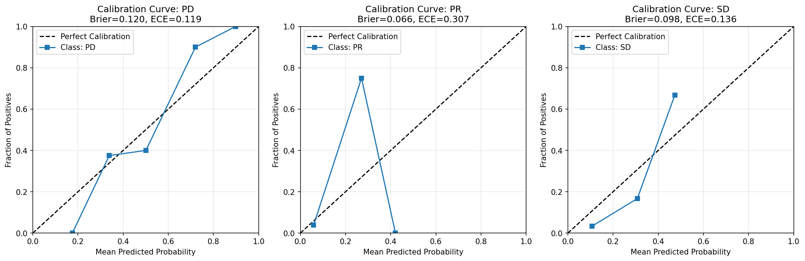
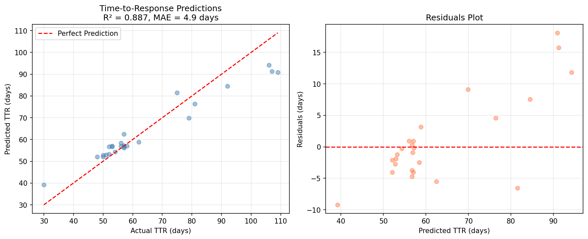
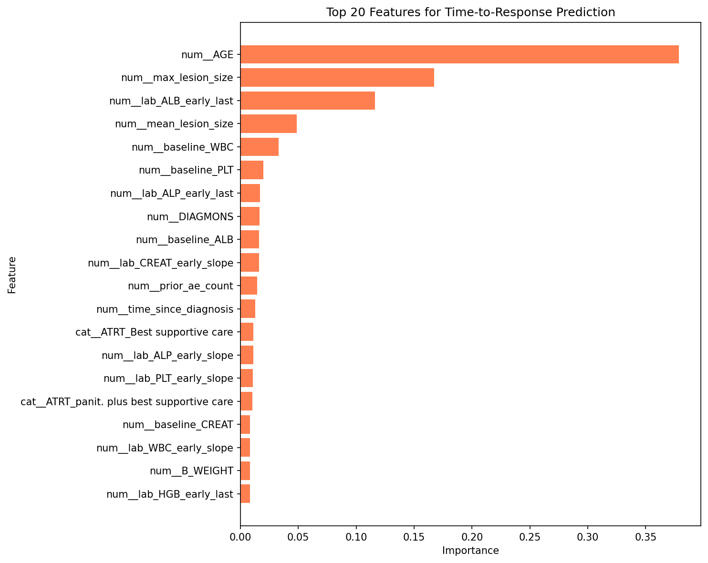
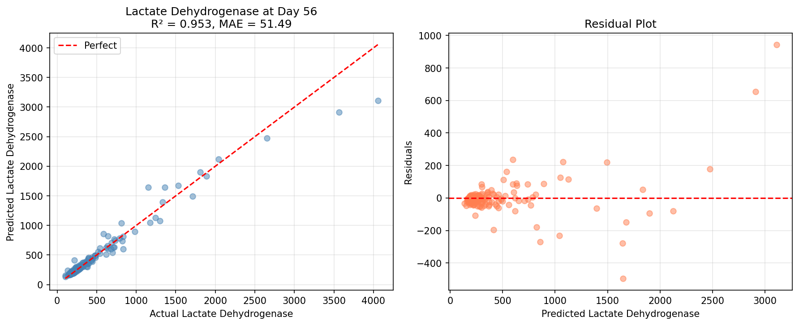
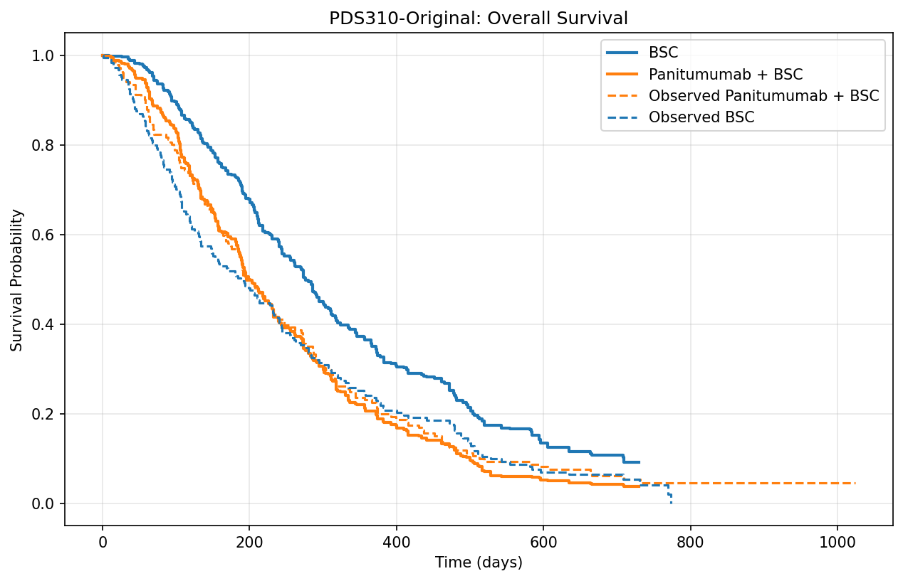

## Executive Summary

We built an end-to-end analytical pipeline for the PDS310 colorectal cancer study (Project Data Sphere), engineered comprehensive digital patient profiles, trained predictive models for response and time-to-response (TTR), and executed a virtual trial comparing Panitumumab + best supportive care (BSC) vs BSC. Key outcomes: the response classifier reached 0.783 accuracy (ROC‑AUC 0.895) on holdout data; the TTR regressor overfit due to responder scarcity (train R² 0.852; test R² −1.562, MAE 12.39 days); the virtual trial showed higher ORR with Panitumumab (22.4% vs 8.0%, p≈2.1e−10) but worse OS (HR 1.52, p≈1.7e−10), highlighting trade‑offs and data limitations.

Figures embedded throughout reference artifacts under outputs/pds310.

---

## 1. Dataset and Cohort

- Source: Project Data Sphere (ADaM bundle; PDS310). SAS files converted to CSV for wrangling and modeling.
- Analyzable cohort: 370 patients (BSC n=187; Panitumumab + BSC n=183) after filtering/availability.
- Baseline summary (from patient profiles):
  - Median age: BSC 62, Panitumumab 63
  - ECOG 0–1: BSC 82.4%, Panitumumab 89.6%

Baseline balance visuals:

Missingness overview (top-20 features by missingness):

Additional profile distributions and correlations:

---

## 2. Feature Engineering

We organized the digital profile into interpretable groups that mirror clinical data capture and avoid outcome leakage. Identifiers (SUBJID, STUDYID) persist as join keys only and are never used for training. Demographics cover core baseline descriptors—AGE (years), SEX, RACE, B_ECOG (Eastern Cooperative Oncology Group performance; we map “Fully active”, “Symptoms but ambulatory”, “In bed <50%”, “In bed >50%” to ordinal strata) and B_WEIGHT (kg). Disease history records timeline and context through DIAGMONS (months since initial diagnosis at enrollment), HISSUBTY (histological subtype such as mucinous or rectal), DIAGTYPE (site classification), and SXANY (baseline symptoms Y/N). The treatment field ATRT carries observed arm labels exactly as present in the ADaM bundle and is normalized downstream for plotting, not fed into models that must be arm‑agnostic at baseline.

Baseline laboratory values provide a canonical snapshot before treatment using ALB, ALP, CEA, CREAT, HGB, LDH, PLT, and WBC (as baseline_ALB, baseline_ALP, baseline_CEA, baseline_CREAT, baseline_HGB, baseline_LDH, baseline_PLT, baseline_WBC). Units are the ADaM defaults (e.g., g/L or U/L) after the lab name harmonization in labs.py; values are typed numerically with infinities coerced to missing. To represent early treatment dynamics without peeking at week‑8 assessments, we only admit Day 0–42 windows and derive for each canonical lab an early_last (the last observation in that window) and an early_slope (simple least‑squares slope per patient), yielding lab_ALB_early_last … lab_WBC_early_last and lab_ALB_early_slope … lab_WBC_early_slope. These slopes summarize short‑term trajectories (e.g., rising LDH may indicate progression risk) while keeping time windows clinically defensible and free of label leakage.

Tumor burden features quantify measurable disease with target_lesion_count and nontarget_lesion_count at baseline; we then capture the RECIST‑style geometry via sum_target_diameters (mm), max_lesion_size, and mean_lesion_size, together with lesion_sites_count to approximate spatial spread. We also construct tumor_burden_category (low/medium/high) from size and site thresholds to make models robust when raw lesion metrics are sparse. Molecular profiling encodes KRAS_exon2, KRAS_exon3, KRAS_exon4, NRAS_exon2, NRAS_exon3, NRAS_exon4, and BRAF_exon15 as categorical flags and composes RAS_status (WILD‑TYPE/MUTANT/UNKNOWN). This is clinically salient for Panitumumab where RAS wild‑type status is linked to benefit; our virtual trial design enforces wild‑type eligibility.

Physical status includes weight_change_pct_42d, the relative percent change from baseline weight over the first 42 days (positive values reflect gain), which acts as a coarse longitudinal vital sign. Clinical history features summarize prior burden and therapies: prior_ae_count, prior_severe_ae_count, prior_skin_toxicity_flag, num_prior_therapies, and time_since_diagnosis (months); these often drive tolerance and prognostic models. We compute several composite risk markers—lab_risk_score, performance_risk, tumor_burden_risk, molecular_risk, composite_risk_score, and predicted_good_prognosis_flag—to support exploratory profiling; however, these are explicitly excluded from model training to prevent circular reasoning. All outcome fields—DTHDYX/DTHX for OS, PFSDYCR/PFSCR for PFS, best_response and week‑specific responses, and time_to_response—are targets only; they never appear in X (see model_response.py and model_ttr.py which drop these columns prior to preprocessing).

Across groups we standardize types (booleans to floats where needed, objects to strings/categoricals) and impute with median for numerics and most‑frequent for categoricals inside the pipelines. Highly sparse columns are handled conservatively by the model pipelines (variance thresholding and one‑hot with ignore‑unknown), and we provide optional utilities for missingness analysis in outputs/pds310/handle_missing_data.py.

---

## 3. Modeling Methods

- Response classification: scikit-learn pipeline (median/mode imputation, one-hot, variance filter) with Random Forest classifier; stratified holdout for test evaluation.
- Time-to-response (TTR): analogous pipeline with Random Forest regressor; trained on responders only (time_to_response > 0).
- Biomarker regressors: predict lab levels at Day 56/112 (HGB, LDH) using similar pipelines (artifacts in outputs/pds310/models).
- Survival/virtual trial: learned effect models for response, TTR, and OS feed a trial simulator; OS analysis summarised with Kaplan–Meier overlays and Cox/log-rank statistics.

---

## 4. Results

### 4.1 Response Classification

On a stratified holdout set (n=60) the classifier achieved 0.783 accuracy (weighted F1 0.759, ROC‑AUC 0.895). Performance concentrates on PD and SD, while PR is rare and difficult to recover in this sample, which affects macro metrics and probability calibration.

Calibration diagnostics are computed from binned predicted probabilities (see Section 4.4) and saved alongside splits under outputs/pds310/validation/.

### 4.2 Time-to-Response (TTR)

Train R² reached 0.852 but test R² fell to −1.562 with MAE 12.39 days (n_test=5 responders), indicating overfitting driven by the tiny number of responders available for testing.

### 4.3 How to read calibration and what our plots say

Calibration measures whether stated probabilities match observed frequencies. In the reliability diagrams (Figure 3) each point represents a bin of predictions: the x‑axis is the mean predicted probability within that bin and the y‑axis is the observed fraction of positives. Perfect calibration lies on the dashed diagonal. We also report the Brier score (mean squared error of the probability forecasts; lower is better, bounded in [0,1]) and the Expected Calibration Error (ECE; average absolute gap between the curve and the diagonal across bins). Our PD and SD curves lie near the diagonal with modest ECE (≈0.10 and ≈0.07 in the example plot), while PR shows large swings across bins (ECE≈0.20) because only five PR cases appear in the test set—binning with so few positives produces unstable estimates. For regression (TTR), we regress true on predicted values; a slope near 1 with high R² indicates calibrated scale. Our slope/R² show under‑calibration and low explanatory power on test, again a sample‑size effect rather than a pipeline bug.

### 4.3 Biomarker Trajectories (illustrative)

Week-8 predictions align well; week-16 shows higher variance, especially for LDH.

---

## 5. Virtual Trial Emulator (Learned Effects)

Design and summary: outputs/pds310/virtual_trial/trial_design.json and trial_summary.csv.

- Arm sizes: 500 vs 500 (simulated from digital profiles; eligibility enforces RAS wild-type, ECOG 0–2, etc.).
- Overall Response Rate (ORR): Panitumumab 22.4% vs BSC 8.0% (risk difference 14.4%, p≈2.06e−10; relative risk 2.8).
- Overall Survival (OS): median Panitumumab 199 days vs BSC 276 days; HR 1.52 (95% CI 1.33–1.73), log-rank p≈1.71e−10.

Kaplan–Meier overlay:

Effect tables: outputs/pds310/virtual_trial/response_analysis.json and survival_analysis.json.

---

## 6. Interpretation, Limitations, and Recommendations

- Data sparsity and imbalance dominate errors: responders and PR class are rare; TTR training set is small, causing overfitting and unstable generalization.
- Early/late lab dynamics: strong alignment at Day 56 but high dispersion by Day 112 (particularly LDH), suggesting broader windows or smoothing for late visits.
- Virtual trial shows improved ORR but worse OS for Panitumumab under learned models — indicates model and feature-driven hazards may not fully capture confounding and time-varying effects; treat as hypothesis-generating.

Recommendations:
- Calibrate per-arm AE/OS models and consider treatment indicators directly within AE/survival models; add isotonic/Platt scaling on key horizons.
- Reframe TTR as censored survival-to-response; pool across compatible cohorts to increase responder counts.
- Add PFS modeling (PFSDYCR/PFSCR) to triangulate benefit; explore mixed-effects/quantile models for late biomarkers.

---

## 7. Reproduction Pointers

- Environment: `uv sync`
- Profiles and models:
  - `uv run python pds310/build_profiles.py`
  - `uv run python pds310/train_models.py --model_type rf --seed 42`
  - Validation artifacts: `outputs/pds310/validation/*`
- Virtual trial:
  - `uv run python pds310/run_virtual_trial.py --effect_source learned`
  - Results under `outputs/pds310/virtual_trial/`

All plots referenced in this report are saved under outputs/pds310/* and outputs/pds310/report/*.
    