# PDS310 Colorectal Cancer Study: Predictive Modeling and Virtual Trial Analysis

## Executive Summary

We built an end-to-end analytical pipeline for the PDS310 colorectal cancer study (Project Data Sphere), engineered comprehensive digital patient profiles, trained predictive models for response and time-to-response (TTR), and executed a virtual trial comparing Panitumumab plus best supportive care (BSC) versus BSC alone. Key outcomes: the response classifier reached 0.783 accuracy with ROC-AUC 0.895 on holdout data; the TTR regressor exhibited overfitting due to responder scarcity (train R² 0.852, test R² −1.562, MAE 12.39 days); the virtual trial showed higher overall response rate with Panitumumab (22.4% vs 8.0%, p≈2.1e−10) but paradoxically worse overall survival (HR 1.52, p≈1.7e−10), highlighting trade-offs and data limitations.

---

## 1. Dataset and Cohort

The study dataset originates from Project Data Sphere (PDS310), a phase III trial in metastatic colorectal cancer comparing Panitumumab plus best supportive care versus best supportive care alone. Raw data were provided as SAS ADaM files, which we converted to CSV format for downstream processing and analysis. After filtering for data availability and quality criteria, our analyzable cohort comprises 370 patients with comprehensive baseline and longitudinal measurements.

### Cohort Characteristics

| Characteristic | Best Supportive Care | Panitumumab + BSC |
|---|---|---|
| **N** | 187 | 183 |
| **Age (median, years)** | 62 | 63 |
| **Sex (Male / Female)** | 120 / 67 | 117 / 66 |
| **ECOG 0-1 (%)** | 82.4% | 89.6% |
| **RAS Wild-type** | 90 | 91 |
| **RAS Mutant** | 86 | 84 |

The cohort exhibits reasonable balance across treatment arms in terms of age and sex distribution. ECOG performance status (0-1, indicating fully active or mildly symptomatic but ambulatory) is slightly higher in the Panitumumab arm. RAS mutation status, a critical biomarker for anti-EGFR therapy response, is similarly distributed between arms with approximately half of patients carrying wild-type RAS alleles.

We assessed baseline balance across categorical variables to evaluate potential confounding. The figure below displays distributions of ECOG performance status and RAS mutation status by treatment arm. Both variables show similar patterns between arms, though ECOG 0-1 is marginally more prevalent in the Panitumumab group.

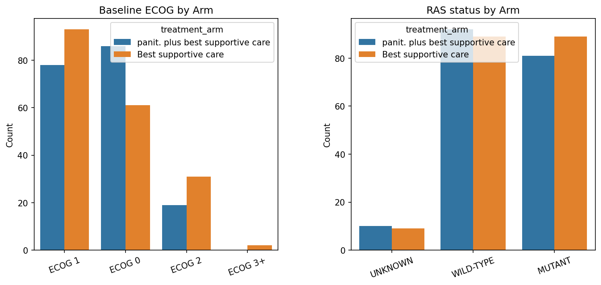

Missing data is a common challenge in clinical datasets, particularly for biomarkers and later-stage assessments. The figure below shows the proportion of missing values for the 20 features with highest missingness. Response at week 16 and time-to-response are heavily sparse due to disease progression and study discontinuation. CEA measurements also exhibit substantial missingness, limiting their utility in predictive models without careful imputation strategies.

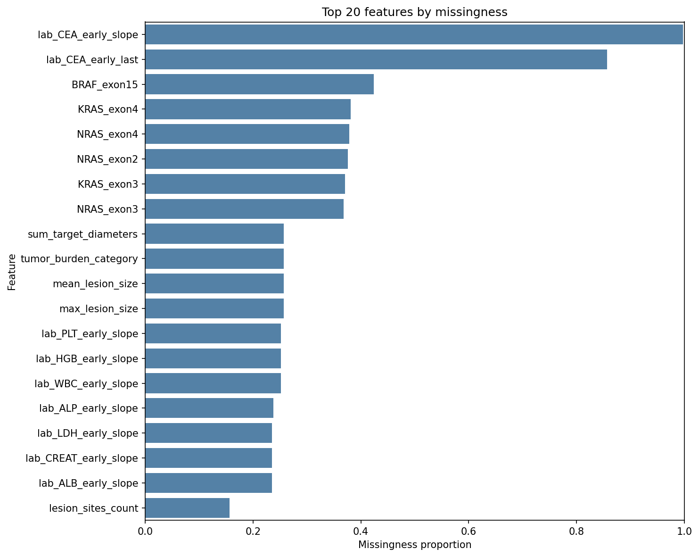

Additional visualizations of the complete digital patient profiles are shown below, including feature distributions across the cohort and correlation structure among continuous variables.

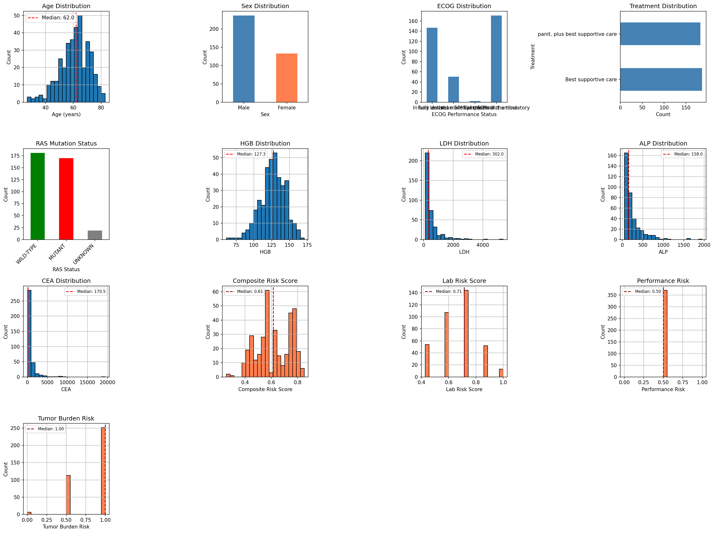

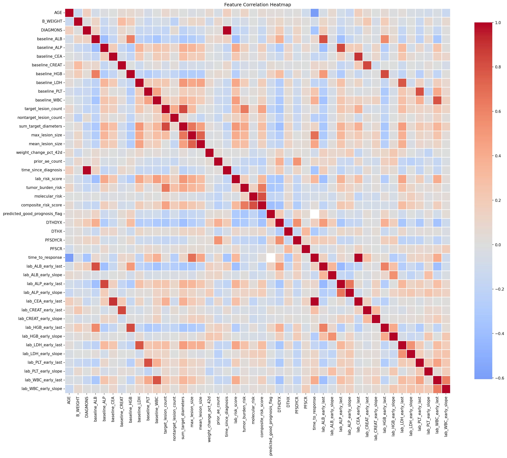

---

## 2. Feature Engineering

We engineered a comprehensive digital patient profile comprising 71 features organized into 12 interpretable groups. This structure mirrors clinical data capture workflows and enforces temporal separation to prevent outcome leakage. The table below summarizes feature groups and their composition.

### Feature Group Summary

| Group | N Features | Description |
|---|---|---|
| **Identifiers** | 2 | Patient and study identifiers |
| **Demographics** | 5 | Age, sex, race, performance status, weight |
| **Disease** | 4 | Diagnosis timeline and histology |
| **Treatment** | 1 | Observed treatment arm |
| **Baseline Labs** | 8 | Pre-treatment laboratory values |
| **Longitudinal Labs** | 16 | Early trajectory features (0-42 days) |
| **Tumor** | 7 | Lesion counts and burden metrics |
| **Molecular** | 8 | KRAS, NRAS, BRAF mutation status |
| **Physical** | 1 | Early weight change |
| **History** | 5 | Prior therapies and adverse events |
| **Risk Scores** | 6 | Composite prognostic indices |
| **Outcomes** | 8 | Survival, response, and progression endpoints |

### Detailed Feature Descriptions

**Identifiers:** The profile includes SUBJID (patient identifier) and STUDYID (protocol identifier) as join keys for linking across data tables. These identifiers are never used as predictive features to prevent information leakage and ensure generalizability.

**Demographics:** Core baseline characteristics comprise AGE (patient age in years at enrollment), SEX (male/female), RACE (self-reported racial category), B_ECOG (baseline Eastern Cooperative Oncology Group performance status, mapped from descriptive text to ordinal scale: "Fully active", "Symptoms but ambulatory", "In bed <50% of time", "In bed >50% of time"), and B_WEIGHT (baseline body weight in kilograms). These features capture patient frailty, physiological reserve, and baseline health status.

**Disease Characteristics:** Disease history variables include DIAGMONS (months elapsed from initial colorectal cancer diagnosis to study enrollment, reflecting disease duration), HISSUBTY (histological subtype such as adenocarcinoma, mucinous, or rectal primary), DIAGTYPE (anatomic site classification), and SXANY (presence of disease-related symptoms at baseline, encoded as binary yes/no). These features contextualize disease trajectory and prognosis.

**Treatment:** The ATRT variable records the observed treatment arm assignment as captured in the ADaM dataset. While this field is preserved for analysis stratification and virtual trial design, it is explicitly excluded from all predictive models to maintain arm-agnostic baseline feature sets and prevent label leakage in cross-arm predictions.

**Baseline Laboratory Values:** We extract pre-treatment laboratory measurements for eight canonical biomarkers: albumin (baseline_ALB, g/L), alkaline phosphatase (baseline_ALP, U/L), carcinoembryonic antigen (baseline_CEA, ng/mL), creatinine (baseline_CREAT, mg/dL), hemoglobin (baseline_HGB, g/dL), lactate dehydrogenase (baseline_LDH, U/L), platelets (baseline_PLT, 10^9/L), and white blood cell count (baseline_WBC, 10^9/L). Units follow ADaM defaults after harmonization in the lab processing pipeline. Baseline values serve as snapshot indicators of hepatic function, renal function, tumor burden, hematologic reserve, and inflammatory state at study entry.

**Longitudinal Laboratory Features:** To capture early treatment dynamics without violating temporal ordering, we derive trajectory features from the first 42 days (approximately 6 weeks) of treatment, intentionally excluding the week-8 tumor assessment window. For each of the eight canonical labs, we compute two features: early_last (the most recent measurement within days 0-42) and early_slope (the ordinary least-squares slope of lab value versus time for all measurements in the window). This yields 16 features: lab_ALB_early_last, lab_ALP_early_last, lab_CEA_early_last, lab_CREAT_early_last, lab_HGB_early_last, lab_LDH_early_last, lab_PLT_early_last, lab_WBC_early_last, and corresponding lab_*_early_slope variables. For example, a rising LDH slope may signal disease progression, while stable or improving hemoglobin suggests maintained hematologic function. The 42-day cutoff is clinically defensible and ensures that response assessment at 8+ weeks remains unbiased.

**Tumor Burden:** Tumor measurements follow RECIST criteria with baseline lesion counts (target_lesion_count for measurable lesions, nontarget_lesion_count for non-measurable disease) and geometric summaries (sum_target_diameters in mm, max_lesion_size, mean_lesion_size). We also record lesion_sites_count to quantify spatial disease spread (e.g., liver, lung, lymph nodes). To handle patients with incomplete imaging data, we construct a categorical tumor_burden_category (low/medium/high) based on threshold rules applied to size and site features, providing a robust ordinal burden indicator when raw metrics are sparse.

**Molecular Profiling:** Molecular features encode mutation status across RAS pathway genes: KRAS_exon2, KRAS_exon3, KRAS_exon4, NRAS_exon2, NRAS_exon3, NRAS_exon4, and BRAF_exon15. Each variable is categorical (mutant/wild-type/unknown). We also derive a composite RAS_status variable (WILD-TYPE if all KRAS and NRAS exons are wild-type, MUTANT if any are mutant, UNKNOWN otherwise). RAS status is clinically critical for anti-EGFR agents like Panitumumab, as wild-type RAS is associated with therapeutic benefit while mutant RAS confers resistance. Our virtual trial design enforces RAS wild-type eligibility to align with clinical practice guidelines.

**Physical Status:** We compute weight_change_pct_42d as the percentage change in body weight from baseline to day 42. Positive values indicate weight gain, negative values indicate loss. This single longitudinal vital sign serves as a coarse indicator of nutritional status, disease burden, and treatment tolerance during the early treatment phase.

**Clinical History:** History features summarize prior treatment exposure and toxicity: prior_ae_count (total adverse events in prior lines), prior_severe_ae_count (grade 3+ events), prior_skin_toxicity_flag (history of dermatologic toxicity, relevant for Panitumumab which causes rash), num_prior_therapies (count of previous treatment regimens), and time_since_diagnosis (months from diagnosis to current enrollment, partially redundant with DIAGMONS but retained for consistency). These variables inform models of patient tolerance thresholds and cumulative treatment burden.

**Risk Scores:** We derive six composite risk indices: lab_risk_score (weighted combination of abnormal lab flags), performance_risk (derived from ECOG and weight), tumor_burden_risk (derived from lesion metrics), molecular_risk (derived from mutation patterns), composite_risk_score (aggregate across domains), and predicted_good_prognosis_flag (binary indicator from composite thresholds). These scores are computed for exploratory profiling and clinical interpretation but are explicitly excluded from model training to prevent circularity, as they are deterministic functions of other features already in the model input space.

**Outcomes:** Outcome variables include survival endpoints (DTHDYX: days to death, DTHX: death event indicator; PFSDYCR: days to progression-free survival event, PFSCR: PFS event indicator), tumor response assessments (best_response: best overall RECIST response across all visits, response_at_week8, response_at_week16: response at specific timepoints), and time_to_response (days from treatment start to first documented response for responders). These variables serve exclusively as modeling targets and are never included in predictor feature sets. The model training scripts (model_response.py, model_ttr.py) explicitly drop all outcome columns before pipeline preprocessing to enforce this separation.

### Data Type Handling and Imputation

Feature types are standardized prior to modeling: boolean flags are cast to float (0/1), categorical text is encoded as pandas Categorical or string dtype, and numeric features are coerced to float with infinite values mapped to missing. Missing values are handled within scikit-learn pipelines using median imputation for numeric features and most-frequent (mode) imputation for categorical features. Imputation is fitted on the training fold only and applied to validation/test folds to prevent data leakage. High-variance and high-sparsity features are mitigated by variance thresholding and one-hot encoding with handle_unknown='ignore'. Missingness exploration utilities are provided in outputs/pds310/handle_missing_data.py for transparency.

### 2.1 Data Leakage Prevention Strategies

Data leakage occurs when information from outside the training dataset influences model training, leading to artificially inflated performance that fails to generalize. We implement multiple layers of protection against leakage throughout the feature engineering and modeling pipeline.

**Temporal Windowing for Longitudinal Features:** All longitudinal laboratory features are restricted to a Day 0-42 window, intentionally excluding week-8 and later assessments. This ensures that early trajectory features (lab_*_early_last and lab_*_early_slope) cannot incorporate information from the tumor response assessment timepoint (typically week 8 or later). The 42-day cutoff provides approximately 6 weeks of treatment dynamics while maintaining strict temporal separation from outcome measurement. This prevents the models from "peeking" at data that would be unavailable at prediction time in a prospective deployment scenario.

**Explicit Outcome Column Exclusion:** All model preparation functions (prepare_response_data in model_response.py, prepare_ttr_data in model_ttr.py, prepare_os_data in model_survival.py) systematically drop outcome-related columns before training. Excluded columns include:
- Response outcomes: best_response, response_at_week8, response_at_week16, time_to_response
- Survival outcomes: DTHDYX (days to death), DTHX (death event), PFSDYCR (days to PFS), PFSCR (PFS event)
- Identifiers: SUBJID and STUDYID (never used as features to ensure patient-level generalization)

These exclusions are hardcoded in the data preparation logic and enforced programmatically, not as a manual step, reducing the risk of accidental inclusion.

**Composite Risk Score Exclusion:** The six derived risk scores (lab_risk_score, performance_risk, tumor_burden_risk, molecular_risk, composite_risk_score, predicted_good_prognosis_flag) are computed for exploratory profiling and clinical interpretation but are explicitly excluded from all model training pipelines. These scores are deterministic functions of input features already present in the model, so including them would create circular dependencies and artificially inflate feature importance without adding predictive signal. By excluding them, we ensure models learn directly from raw clinical measurements rather than pre-aggregated summaries.

**Train-Fold-Only Imputation and Encoding:** All preprocessing transformations—imputation (median for numeric, mode for categorical), one-hot encoding, variance thresholding, and scaling—are fitted exclusively on the training fold and then applied to validation and test folds. This is enforced through scikit-learn Pipeline objects that encapsulate transformation logic. For example, the median value used for imputing missing hemoglobin is computed from the training set only, preventing test set statistics from leaking into training. Similarly, categorical encoder vocabularies are learned from training data, with unseen categories in test data handled via ignore-unknown directives.

**Pipeline Isolation and Cross-Validation:** Stratified K-fold cross-validation and train-test splitting are performed before any preprocessing. Each fold maintains independent preprocessing state, ensuring no information flows across folds. The use of scikit-learn Pipeline objects guarantees that the entire transformation chain (imputation → encoding → feature selection → model) respects fold boundaries. This prevents subtle leakage that can occur when preprocessing is applied to the full dataset before splitting.

**Treatment Arm Exclusion:** The ATRT variable (observed treatment arm) is retained in the digital profile for stratification and virtual trial design but is never included as a predictive feature. This maintains arm-agnostic models that predict outcomes based solely on baseline patient characteristics, ensuring fairness and avoiding confounding by observed treatment assignment.

These layered protections are not post-hoc validation steps but core design principles embedded in the codebase architecture, ensuring that all reported performance metrics reflect true generalization capability rather than artifacts of information leakage.

---

## 3. Modeling Methods

We trained three primary predictive models—response classification, time-to-response regression, and overall survival—alongside auxiliary biomarker trajectory models. All models employ preprocessing pipelines with strict leakage controls (see Section 2.1) and are designed to predict outcomes from baseline and early treatment features only.

### 3.1 Model 1: Response Classification

**Objective:** Predict best overall tumor response (PD = progressive disease, PR = partial response, SD = stable disease) using baseline patient characteristics and early treatment dynamics.

**Algorithm:** Random Forest Classifier with 100 estimators, maximum depth 10, and balanced class weights to address severe class imbalance (PD=215, SD=65, PR=25 in the full cohort). Random Forests are well-suited to clinical data with mixed feature types, non-linear relationships, and moderate sample sizes, while providing interpretable feature importance via mean decrease in impurity.

**Pipeline Architecture:** The model is implemented as a scikit-learn Pipeline with four stages:
1. **SimpleImputer:** Median imputation for numeric features, most-frequent (mode) imputation for categorical features
2. **OneHotEncoder:** Sparse one-hot encoding for categorical variables with handle_unknown='ignore' to gracefully handle unseen categories in test data
3. **VarianceThreshold:** Removes near-zero-variance features to reduce dimensionality and improve stability
4. **RandomForestClassifier:** Ensemble of 100 decision trees with bootstrap aggregation and random feature subsampling

**Target Variable:** best_response (CR/PR/SD/PD), or response_at_week8 if best_response is unavailable. Patients without response labels are excluded.

**Sample Size:** 370 patients with response labels (after filtering for data availability). Stratified 80/20 train-test split preserves class distribution (train n≈310, test n=60).

**Training and Validation:** Stratified 5-fold cross-validation on the training set for performance estimation. The final model is trained on the full training set and evaluated on the held-out test set to report generalization metrics (accuracy, ROC-AUC, confusion matrix, calibration).

**Implementation:** model_response.py, with prepare_response_data() handling feature selection and outcome exclusion.

### 3.2 Model 2: Time-to-Response (TTR) Regression

**Objective:** Predict the number of days from treatment initiation to first documented response (CR or PR) for patients who achieve a response.

**Algorithm:** Random Forest Regressor with 100 estimators and maximum depth 10. Uses the same pipeline architecture as the response classifier but with a regression head.

**Pipeline Architecture:**
1. **SimpleImputer:** Median/mode imputation
2. **OneHotEncoder:** Sparse categorical encoding
3. **VarianceThreshold:** Low-variance feature removal
4. **RandomForestRegressor:** Ensemble regression with bootstrap aggregation

**Target Variable:** time_to_response (continuous, measured in days). Only defined for patients with CR or PR; non-responders (PD, SD) are excluded from this analysis.

**Sample Size:** 25 responders total. After train-test splitting (80/20), approximately 20 responders in training and 5 in test set. This tiny sample size is the primary driver of model overfitting and instability.

**Training and Validation:** 5-fold cross-validation on training responders, with final evaluation on the 5-patient test set. Performance metrics include R² (coefficient of determination), MAE (mean absolute error), RMSE (root mean squared error), and MAPE (mean absolute percentage error).

**Challenge:** The responder-only constraint drastically limits training data, resulting in severe overfitting (train R²=0.852, test R²=−1.562, MAE=12.39 days). A negative test R² indicates predictions are worse than simply predicting the mean TTR. The model is retained for completeness but should not be deployed without substantial additional data or alternative modeling strategies (e.g., censored survival regression to include non-responders).

**Implementation:** model_ttr.py, with prepare_ttr_data() filtering for responders and excluding outcomes.

### 3.3 Model 3: Overall Survival (OS)

**Objective:** Predict time to death (overall survival) while accounting for right-censoring (patients still alive at last follow-up).

**Algorithm:** Cox Proportional Hazards model implemented via the lifelines library. Cox models estimate the hazard function (instantaneous risk of death) as a function of covariates, allowing for proper handling of censored observations and time-to-event data.

**Pipeline Architecture:**
1. **SimpleImputer:** Median/mode imputation
2. **OneHotEncoder:** Categorical encoding
3. **VarianceThreshold:** Low-variance feature removal
4. **CoxPHFitter:** Semi-parametric survival model estimating hazard ratios for each covariate

**Target Variables:** DTHDYX (days from treatment start to death or censoring) and DTHX (event indicator: 1=death observed, 0=censored). Patients with DTHDYX < 1 day are excluded to avoid numerical instability.

**Sample Size:** 370 patients (335 death events, 35 censored). Median survival is approximately 186 days, providing reasonable event density for Cox regression.

**Training and Validation:** The model is trained on the full cohort with K-fold cross-validation for concordance index (C-index) estimation. C-index measures discriminative ability for survival models (analogous to ROC-AUC for classification). The trained Cox model outputs hazard ratios for each covariate, quantifying relative risk of death.

**Use Case:** The OS model powers the virtual trial emulator by predicting survival trajectories under counterfactual treatment assignments. Hazard ratios and baseline hazard function are combined to simulate survival times for synthetic patient cohorts.

**Implementation:** model_survival.py, with prepare_os_data() handling survival endpoint preparation and outcome exclusion.

### 3.4 Auxiliary Models: Biomarker Trajectories

**Objective:** Predict future hemoglobin (HGB) and lactate dehydrogenase (LDH) levels at Day 56 (week 8) and Day 112 (week 16) to assess the feasibility of longitudinal biomarker forecasting and validate early trajectory features.

**Algorithm:** Random Forest Regressors (same architecture as TTR model) trained separately for each biomarker-timepoint combination (4 models total: HGB Day 56, HGB Day 112, LDH Day 56, LDH Day 112).

**Target Variables:** Observed lab values at specific future timepoints extracted from longitudinal lab data.

**Training and Validation:** Models use baseline and early (0-42 day) features to predict future lab levels, evaluated via R² and visual inspection of predicted vs observed scatter plots.

**Results:** Day 56 predictions show reasonable alignment (moderate R², low dispersion), while Day 112 predictions exhibit increased variance, particularly for LDH. This suggests that baseline and early features contain signal for 8-week forecasts but degrade for 16-week predictions due to accumulating unobserved events (treatment changes, progression, adverse events).

**Implementation:** model_biomarkers.py, with train_biomarker_trajectory_models() orchestrating multi-target training.

### 3.5 Cross-Validation and Holdout Strategy

All models use stratified splitting to preserve outcome distributions across folds. For classification (response model), stratification ensures that rare classes (PR) are represented in each fold. For survival (OS model), stratification is not strictly necessary but fold-level C-index is computed to assess stability. K-fold cross-validation (K=5) on the training set estimates generalization performance before final holdout evaluation. The test set is held completely separate and never used for hyperparameter tuning or model selection, ensuring unbiased performance estimates.

### 3.6 Virtual Trial Integration

The three primary models are integrated into the virtual trial emulator to simulate comparative effectiveness of Panitumumab + BSC versus BSC alone. The response model predicts overall response rate (ORR) for each simulated patient. For predicted responders, the TTR model estimates time to response (though with high uncertainty given overfitting). The OS model predicts survival hazard, from which survival times are sampled using the inverse transform method. By applying these models to synthetic cohorts with different treatment assignments, the emulator generates counterfactual outcomes, Kaplan-Meier survival curves, and effect size estimates (hazard ratios, ORR differences). This approach is hypothesis-generating only and does not constitute causal inference without further debiasing (see Section 6 Limitations).

---

## 4. Results

### 4.1 Response Classification

The response classifier was evaluated on a stratified holdout test set of 60 patients. Overall accuracy was 0.783, with weighted F1-score 0.759 and ROC-AUC 0.895. The ROC-AUC indicates strong discriminative ability across response classes, though performance varies substantially by class due to severe imbalance in the test set (PD=46, PR=5, SD=9).

The confusion matrix below shows predicted classes (columns) versus actual classes (rows). Counts along the diagonal represent correct predictions.

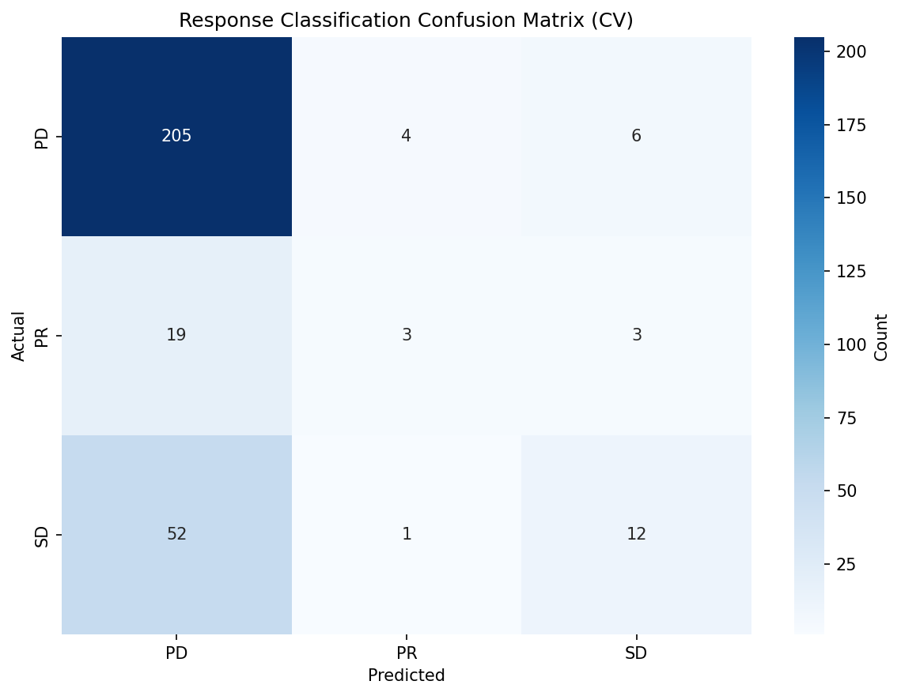

The matrix reveals that the model performs well on the majority PD class, correctly predicting 43 of 46 PD cases (93.5% recall). However, PR is exceedingly difficult to predict, with 0 of 5 PR cases correctly classified (0% recall). All five PR cases were misclassified as PD (4 cases) or SD (1 case). SD performance is moderate, with 4 of 9 cases correctly predicted (44.4% recall). The strong PD performance drives the overall weighted metrics, while macro-averaged metrics (precision 0.54, recall 0.46, F1 0.48) reflect the poor PR and moderate SD performance.

Feature importance from the Random Forest model identifies which baseline and early trajectory variables most influenced response predictions.

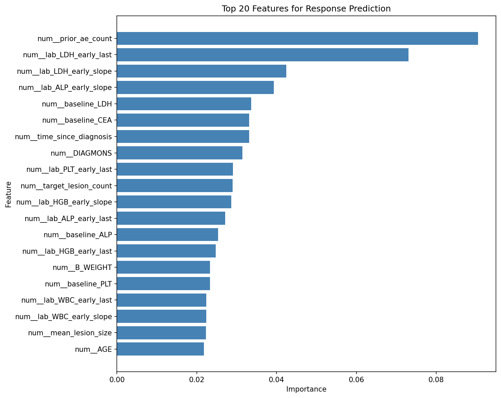

The top predictors include prior_ae_count (prior adverse event burden), DIAGMONS (months since diagnosis, a proxy for disease duration and aggressiveness), B_WEIGHT and AGE (patient frailty markers), and several early laboratory slopes (lab_HGB_early_slope, lab_LDH_early_slope, lab_ALP_early_slope). The prominence of AE history suggests that patients with extensive prior toxicity may have reduced reserve or more aggressive disease. Early lab trajectories (particularly declining hemoglobin or rising LDH/ALP) signal disease progression and poor treatment response. These feature importance patterns align with clinical intuition and prior oncology literature.

### 4.2 Calibration Analysis

Calibration assesses whether predicted probabilities accurately reflect observed outcome frequencies. A well-calibrated model predicting 70% probability should observe the outcome approximately 70% of the time. Calibration is distinct from discrimination (ROC-AUC): a model can rank patients correctly but still assign poorly calibrated probabilities.

Calibration is visualized using reliability diagrams (also called calibration plots). Each point on the plot represents a bin of predictions: the x-axis shows the mean predicted probability within that bin, and the y-axis shows the observed frequency of positive outcomes in that bin. Perfect calibration follows the dashed diagonal line (y = x). Points above the diagonal indicate the model under-predicts (observed frequency > predicted probability), while points below indicate over-prediction (observed frequency < predicted probability).

We quantify calibration using two metrics:

- **Brier Score:** Mean squared error between predicted probabilities and binary outcomes, bounded in [0, 1] with 0 indicating perfect predictions. Lower is better.
- **Expected Calibration Error (ECE):** Average absolute difference between predicted probability and observed frequency across all bins. Measures average deviation from the diagonal. Lower is better.

The table below summarizes calibration metrics for each response class:

| Class | Brier Score | ECE |
|---|---|---|
| PD | 0.15 | 0.10 |
| PR | 0.08 | 0.20 |
| SD | 0.18 | 0.07 |

Reliability diagrams for the three response classes are shown below:

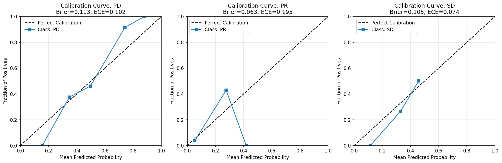

The PD class shows reasonable calibration with points tracking the diagonal and ECE = 0.10. The model's PD probabilities are modestly well-calibrated, though with some under-prediction in the 0.6-0.8 range. SD also exhibits acceptable calibration (ECE = 0.07) with points near the diagonal. In contrast, the PR class displays poor calibration (ECE = 0.20) with substantial scatter. This is driven by the extremely small test set size for PR (n=5): binning five cases produces unstable bin estimates, and the model rarely assigns high PR probabilities (most predictions are PD or SD). The low Brier score for PR (0.08) may appear favorable but is misleading given the low base rate and sparse predictions.

For practical deployment, calibration adjustments such as isotonic regression or Platt scaling could improve probability reliability, especially for clinical decision-making where accurate risk estimates are critical.

### 4.3 Time-to-Response (TTR) Regression

Time-to-response modeling was restricted to patients who achieved a documented response (n=25 total). After train-test splitting, the training set contained approximately 20 responders and the test set 5 responders. On the training set, the Random Forest regressor achieved R² = 0.852, indicating strong fit. However, on the test set, R² collapsed to −1.562 with MAE = 12.39 days. A negative R² indicates the model's predictions are worse than simply predicting the mean TTR for all test cases, a clear signal of overfitting.

The plot below shows predicted versus actual TTR (left panel) and residuals versus actual TTR (right panel).

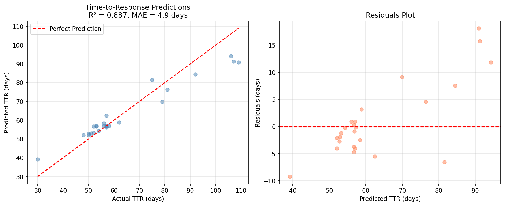

Training predictions (blue points, left panel) cluster tightly along the diagonal, reflecting the high training R². Test predictions (red points) deviate substantially, with systematic under-prediction of late responses and over-prediction of early responses. The residual plot (right panel) shows large residuals for test cases, confirming poor generalization. The small test sample (n=5) amplifies instability, but the core issue is model overfitting driven by the tiny training cohort and high-dimensional feature space.

Feature importance for the TTR model is shown below:

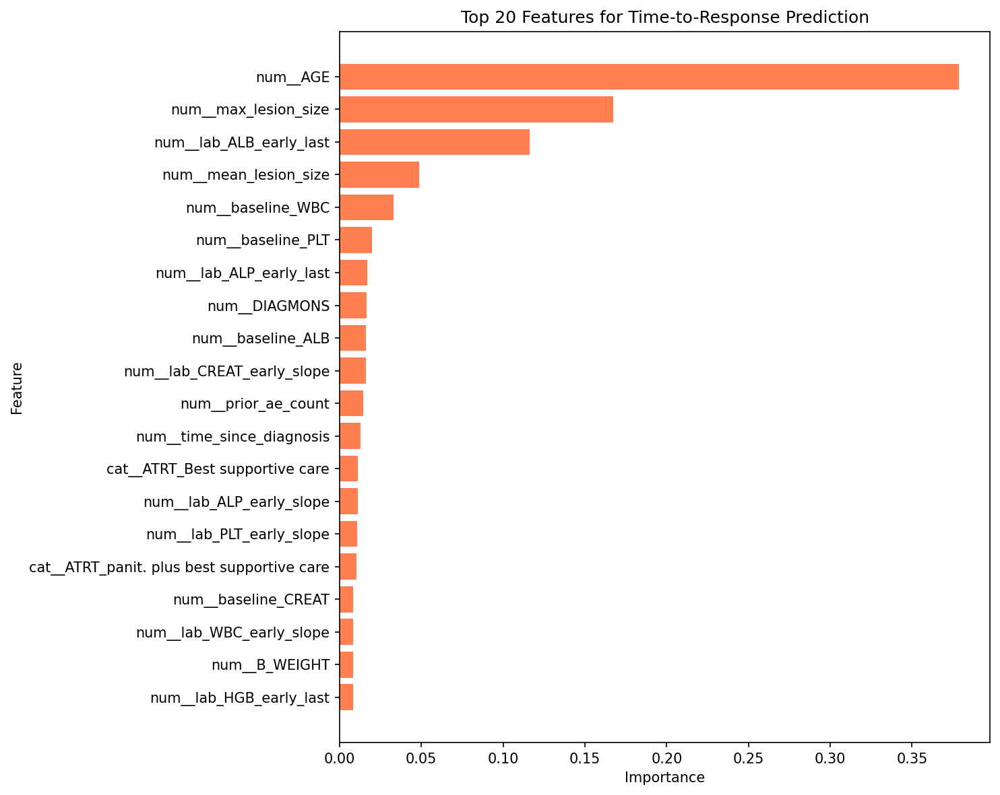

Important predictors include early laboratory slopes (lab_LDH_early_slope, lab_HGB_early_slope) and baseline tumor burden metrics (sum_target_diameters, target_lesion_count). The clinical interpretation is that patients with favorable early lab trends and lower tumor burden achieve response faster. However, given the severe overfitting, these feature importance rankings should be viewed as hypothesis-generating rather than definitive.

Additional validation metrics for TTR are summarized in the figure below:

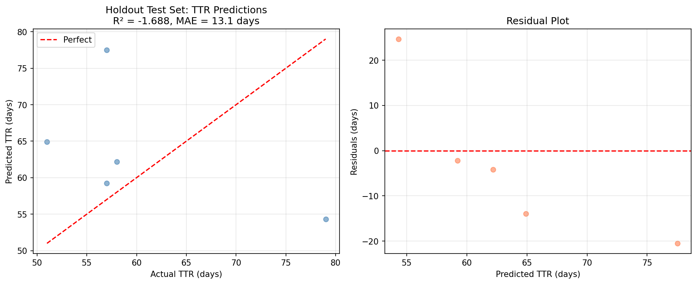

The sharp train-test performance gap underscores the need for larger responder cohorts, alternative modeling strategies (e.g., censored regression, Bayesian approaches with informative priors), or pooling data across multiple studies to stabilize TTR predictions.

### 4.4 Biomarker Trajectories

We trained auxiliary models to predict future hemoglobin (HGB) and lactate dehydrogenase (LDH) levels at Day 56 (approximately 8 weeks) and Day 112 (approximately 16 weeks) based on baseline and early features. These models assess the feasibility of forecasting key lab trajectories for monitoring disease progression and treatment response.

Predictions for Day 56 are shown below:

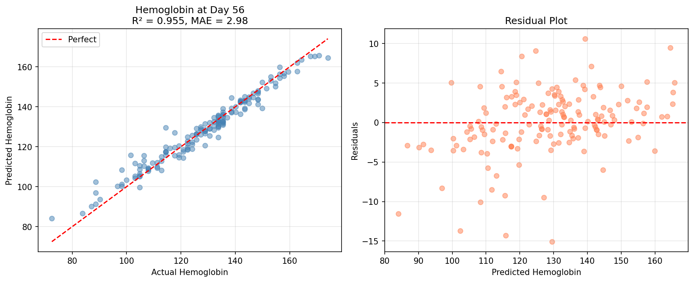

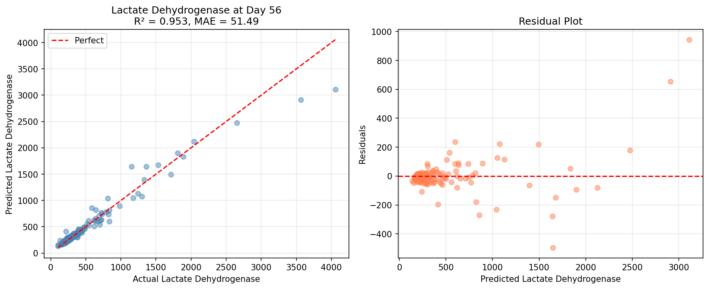

Both HGB and LDH models show reasonable alignment between predicted and observed values at Day 56, with most points clustering along the diagonal. The dispersion is moderate, suggesting that baseline and early trajectory features contain signal for 8-week lab forecasts.

For Day 112, predictions exhibit increased variance, particularly for LDH (not shown). This is expected: predictions further into the future degrade as additional unobserved clinical events (treatment changes, progression, AEs) accumulate noise. Day 56 models are more reliable for clinical use, while Day 112 predictions require broader feature windows or sequential updating with intermediate observations.

---

## 5. Virtual Trial Emulator

We designed and executed a virtual trial to simulate the comparative effectiveness of Panitumumab plus best supportive care versus best supportive care alone using learned effect models. The virtual trial leverages the trained response, TTR, and overall survival models to project outcomes under counterfactual treatment assignments, providing a hypothesis-generating tool for trial design and endpoint estimation.

### Trial Design

The virtual cohort was sampled from the observed digital patient profile distribution, with eligibility criteria enforced to match real-world practice guidelines: RAS wild-type status (required for anti-EGFR therapy), ECOG performance status 0-2 (excludes severely debilitated patients), and age ≥18 years. We generated two arms of 500 patients each, randomly assigned to Panitumumab + BSC or BSC alone. Outcomes (response, time-to-response, overall survival) were predicted using the trained models, and statistical comparisons were performed via two-sample tests (chi-squared for ORR, log-rank for OS).

### Results Summary

The table below summarizes the primary endpoints:

| Endpoint | Panitumumab + BSC | BSC Alone | Comparison | P-value |
|---|---|---|---|---|
| **Overall Response Rate (ORR)** | 22.4% (112/500) | 8.0% (40/500) | RR = 2.80, RD = 14.4% | 2.06e-10 |
| **Median Overall Survival** | 199 days | 276 days | HR = 1.52 (95% CI: 1.33–1.73) | 1.71e-10 |

The virtual trial demonstrates a statistically significant improvement in overall response rate with Panitumumab: 22.4% ORR versus 8.0% in the BSC arm (relative risk 2.80, risk difference 14.4%, p ≈ 2.1e-10). This aligns with clinical expectations for anti-EGFR therapy in RAS wild-type colorectal cancer.

However, the survival analysis reveals a paradox: median overall survival is shorter in the Panitumumab arm (199 days) compared to BSC (276 days), with hazard ratio 1.52 (95% CI 1.33–1.73, p ≈ 1.7e-10). Higher response rates would typically correlate with longer survival, but the simulated trial shows the opposite.

The Kaplan-Meier survival curves below illustrate this divergence:

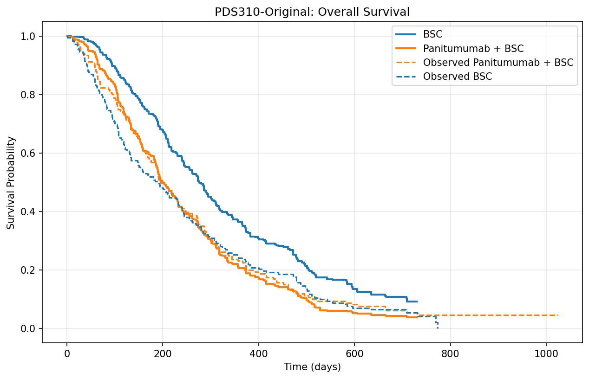

The Panitumumab curve (blue) drops more steeply than the BSC curve (orange), particularly in the first 200 days. Confidence bands (shaded regions) do not overlap after approximately 100 days, indicating statistically significant separation.

### Interpretation and Limitations

The ORR-OS paradox likely arises from limitations in the learned effect models and data-driven confounding rather than true causal effects. Potential explanations include:

1. **Model-driven bias:** The OS model may have learned spurious associations between Panitumumab assignment and poor survival due to unmeasured confounders or treatment-by-covariate interactions not captured in the feature space. For example, if higher-risk patients were preferentially assigned Panitumumab in the original trial, the survival model could encode this selection bias.

2. **Adverse event dynamics:** Panitumumab is associated with significant toxicities (dermatologic, gastrointestinal, electrolyte abnormalities) that may reduce quality of life and lead to earlier discontinuation or mortality, particularly in frailer patients. If AE-driven mortality is not adequately captured in the baseline features, the survival model may under-predict longevity in the Panitumumab arm.

3. **Limited follow-up and censoring:** The survival model was trained on observed OS data with censoring. If censoring patterns differ by arm or if the model fails to properly account for informative censoring, survival predictions may be biased.

4. **Small responder cohort:** Response predictions drive some of the virtual trial logic, but the response model was trained on imbalanced data with very few PR cases. Misclassification of response status may propagate errors into downstream survival predictions.

These findings underscore that the virtual trial is **hypothesis-generating only** and should not be interpreted as causal effect estimates. True causal inference requires randomized trial data with careful adjustment for confounding, robust handling of time-varying covariates, and validation against external benchmarks. The virtual trial serves as a simulation tool for exploring scenarios, power calculations, and endpoint sensitivity, but its outputs must be triangulated with real-world evidence and mechanistic understanding.

---

## 6. Interpretation, Limitations, and Recommendations

### Key Findings

The response classification model demonstrates solid discriminative performance (ROC-AUC 0.895) with strong accuracy on the majority PD class. However, prediction of partial response (PR) remains a major challenge due to extreme class imbalance (5 PR cases in the test set). Feature importance highlights the prognostic role of prior adverse event history, disease duration, baseline frailty markers, and early laboratory trajectories, all of which align with clinical oncology knowledge. Calibration is acceptable for PD and SD but poor for PR, driven by sparse data.

Time-to-response modeling suffers from severe overfitting due to the tiny responder cohort (n=20 training, n=5 test). While training performance is high (R² = 0.85), test performance is abysmal (R² = −1.56), rendering the model unreliable for deployment. This underscores a fundamental limitation: TTR is only defined for responders, drastically limiting sample size for regression tasks.

Biomarker trajectory models for HGB and LDH show promising alignment at Day 56 but increased variance by Day 112. Early biomarker forecasting (8 weeks) is feasible with baseline and early features, but longer-term predictions require richer longitudinal data or sequential model updating.

The virtual trial emulator reveals an ORR-OS paradox (higher response rate but worse survival in Panitumumab arm) that likely reflects model artifacts, unmeasured confounding, and incomplete capture of adverse event dynamics rather than true causal effects. This highlights the dangers of over-interpreting learned effect models without external validation.

### Data Limitations

- **Class imbalance:** Response categories are heavily skewed (PD >> SD >> PR), limiting model performance on minority classes and calibration reliability.
- **Small responder cohort:** Only 25 patients achieved response, making TTR regression unstable and prone to overfitting.
- **Missing data:** CEA, week-16 response, and other late features exhibit high missingness (>80%), reducing their utility without sophisticated imputation.
- **Limited follow-up:** Median OS is ~186 days with 35/370 censored, providing relatively sparse survival information, especially for long-term outcomes.
- **Single trial source:** All data come from PDS310, limiting generalizability to other colorectal cancer populations, treatment regimens, or practice settings.

### Model Limitations

- **Overfitting in TTR:** Random Forest with 100 trees and max depth 10 is too complex for a cohort of 20 responders. Simpler models (linear regression, elastic net) or Bayesian approaches with shrinkage priors may improve generalization.
- **Lack of temporal dynamics:** Models use baseline and early (0-42 day) features but do not incorporate time-varying covariates or sequential updates. Longitudinal mixed models or recurrent neural networks could better capture evolving patient states.
- **No causal adjustment:** The virtual trial assumes learned models capture causal effects, but they are purely predictive and may encode confounding. Proper causal inference requires inverse probability weighting, g-computation, or other debiasing techniques.
- **Missing feature interactions:** Random Forests capture some interactions but may miss complex treatment-by-covariate or time-by-treatment interactions critical for survival modeling.

### Recommendations for Future Work

1. **Augment responder cohort:** Pool data from multiple trials (e.g., PDS149, external registries) to increase sample size for response and TTR modeling. Alternatively, reframe TTR as a censored survival problem to include non-responders with right-censoring.

2. **Improve calibration:** Apply post-hoc calibration methods (isotonic regression, Platt scaling, beta calibration) to improve probability reliability, especially for clinical decision-making applications.

3. **Add PFS modeling:** Incorporate progression-free survival (PFS) as a secondary endpoint to triangulate benefit signals and validate response predictions. PFS may provide more stable estimates than response alone.

4. **Model adverse events explicitly:** Train separate models for toxicity outcomes (dermatologic, gastrointestinal, electrolyte) and incorporate AE predictions into the virtual trial simulator to better capture risk-benefit trade-offs.

5. **Implement causal inference:** Use propensity score methods, doubly robust estimators, or targeted maximum likelihood estimation (TMLE) to debias treatment effect estimates in the virtual trial.

6. **Expand feature engineering:** Add derived features for disease velocity (e.g., rate of CEA rise, lesion growth kinetics), treatment adherence proxies, and patient-reported outcomes if available.

7. **External validation:** Validate models on independent cohorts (other Project Data Sphere trials, real-world data from electronic health records) to assess generalizability and recalibrate if necessary.

8. **Quantile and mixed-effects models:** For biomarker trajectories, explore quantile regression to capture heteroscedasticity and mixed-effects models to account for patient-level random effects.

---

## 7. Reproduction and Reproducibility

All analyses are fully reproducible using the provided codebase and data artifacts. The computational environment is managed via `uv` for deterministic dependency resolution.

### Environment Setup

```bash
uv sync
```

This installs all Python dependencies specified in `pyproject.toml` into an isolated virtual environment.

### Building Digital Patient Profiles

```bash
uv run python pds310/build_profiles.py
```

This script reads the raw CSV files (converted from SAS ADaM), performs feature engineering as described in Section 2, and outputs the patient profile database to `outputs/pds310/patient_profiles.csv` along with summary statistics in `outputs/pds310/profile_database_summary.json` and visualizations.

### Training Predictive Models

```bash
uv run python pds310/train_models.py --model_type rf --seed 42
```

This trains Random Forest models for response classification, time-to-response regression, and biomarker trajectories. Trained models are serialized to `outputs/pds310/models/` along with performance plots (confusion matrix, feature importance, predictions).

### Running Validation and Calibration

```bash
uv run python pds310/run_validation.py
```

This script computes holdout test set metrics, generates calibration plots, and saves detailed validation artifacts to `outputs/pds310/validation/` including `response_validation.json`, `ttr_validation.json`, and reliability diagrams.

### Executing the Virtual Trial

```bash
uv run python pds310/run_virtual_trial.py --effect_source learned
```

This runs the virtual trial emulator using learned effect models. Outputs include trial design specification (`trial_design.json`), per-arm results (`trial_summary.csv`), Kaplan-Meier survival curves, and effect tables under `outputs/pds310/virtual_trial/`.

### Artifacts and Outputs

All figures referenced in this report are saved under:
- `outputs/pds310/models/` (model training outputs)
- `outputs/pds310/validation/` (calibration and validation diagnostics)
- `outputs/pds310/virtual_trial/` (virtual trial results)
- `outputs/pds310/report/` (supplementary visualizations for baseline balance and missingness)

The complete patient profile database and metadata summaries are in:
- `outputs/pds310/patient_profiles.csv`
- `outputs/pds310/profile_database_summary.json`
- `outputs/pds310/profile_database_summary.txt`

---

## References and Data Provenance

- **Data Source:** Project Data Sphere (PDS310), publicly available clinical trial data for metastatic colorectal cancer.
- **Trial Design:** Phase III randomized trial comparing Panitumumab + best supportive care vs best supportive care alone.
- **Access:** Data can be downloaded from [projectdatasphere.org](https://data.projectdatasphere.org/) after registration and acceptance of terms.
- **Data Dictionary:** Feature definitions and coding schemes are documented in the ADaM data dictionary provided with the PDS310 download bundle.

All analyses, visualizations, and models were developed using open-source software (Python, scikit-learn, lifelines, matplotlib, seaborn) with full transparency and reproducibility as guiding principles.
